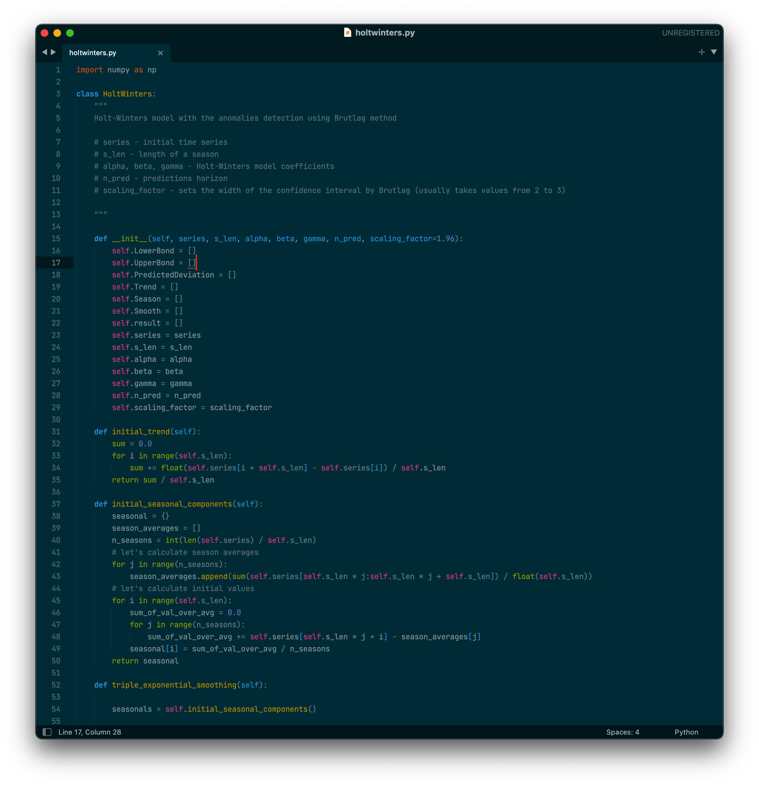
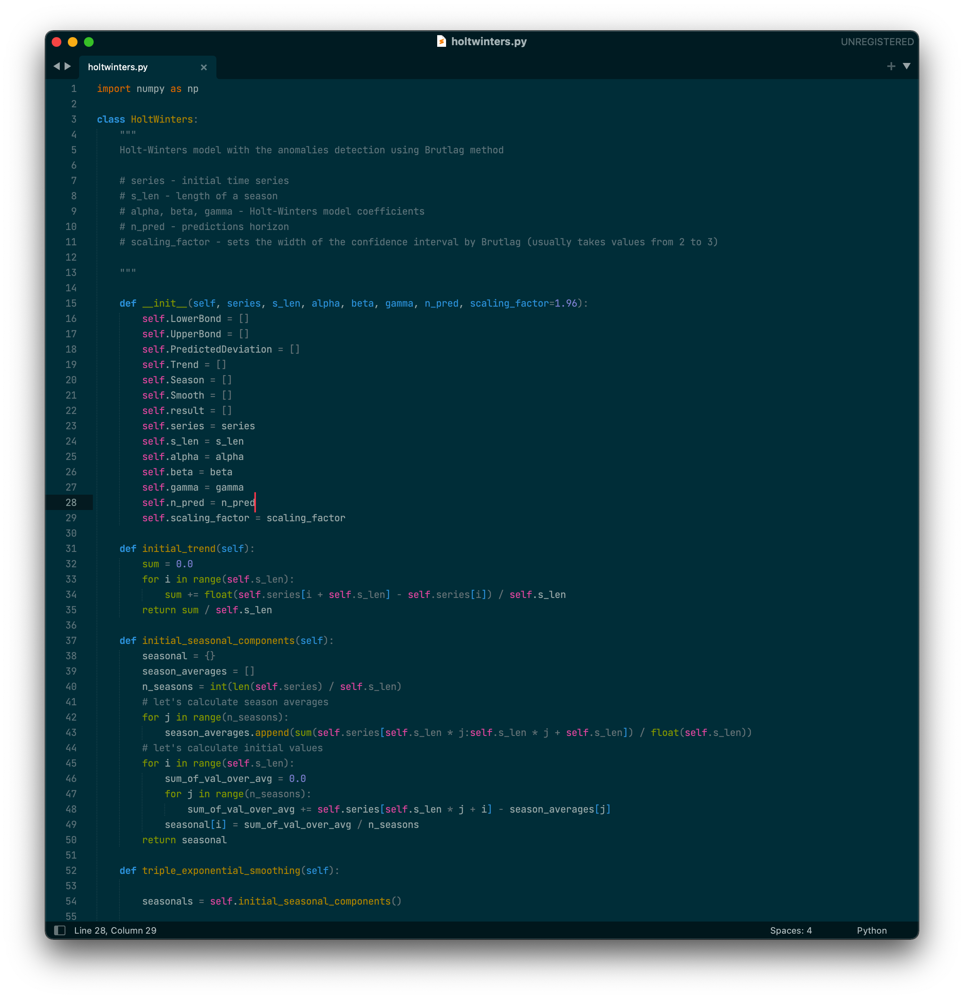
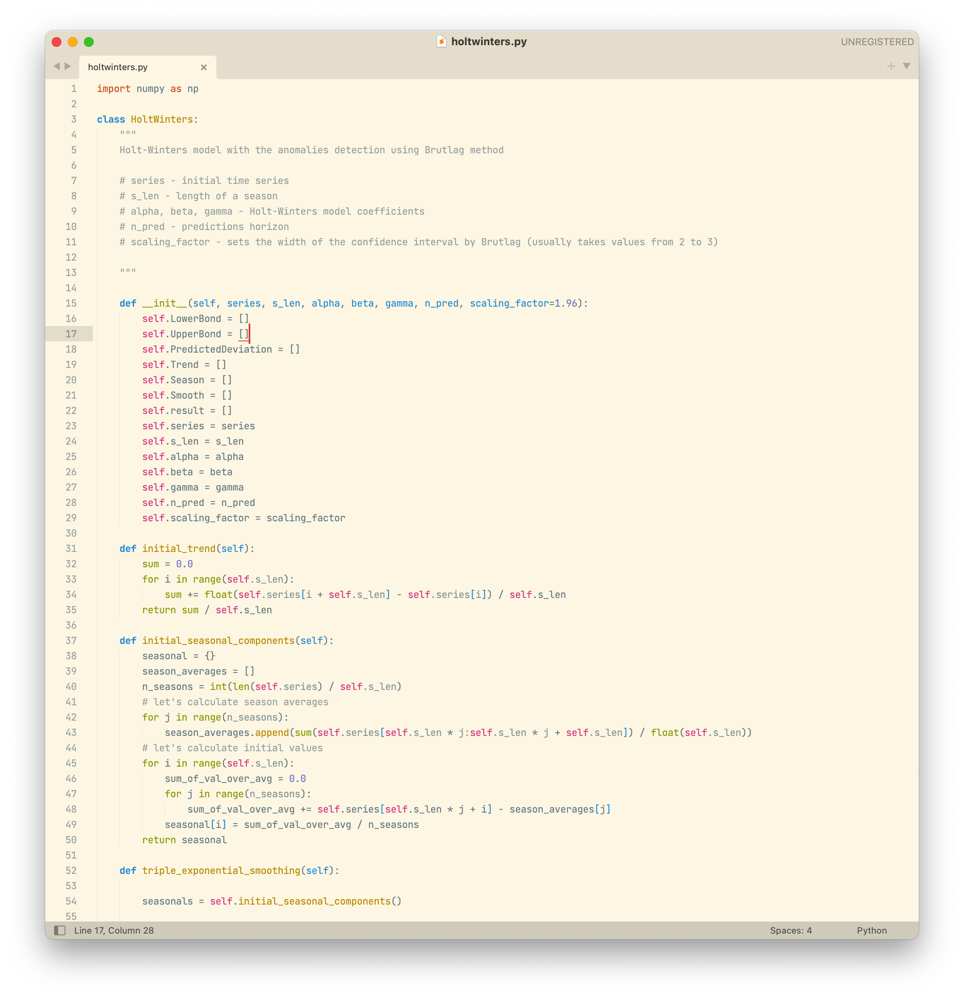
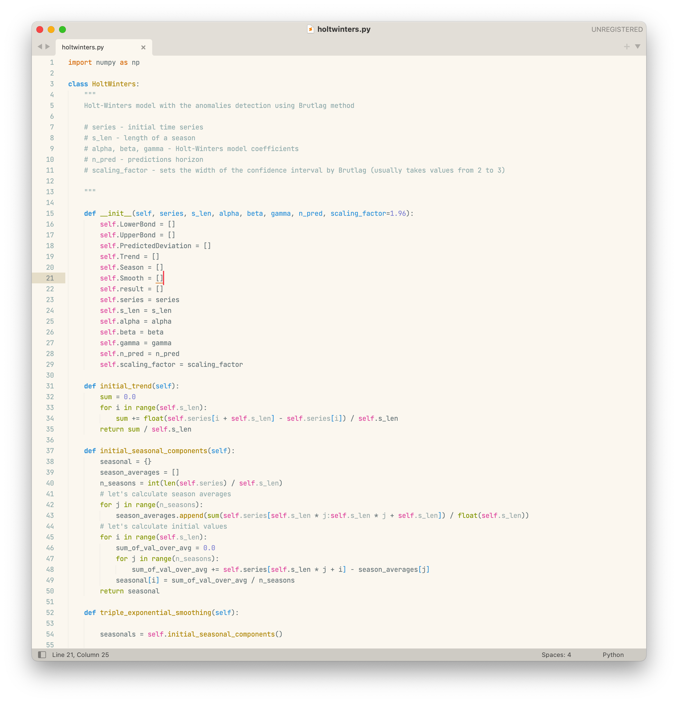

# Solarized Lab – Adaptive Color Schemes

A collection of Solarized dark and light color schemes in perceptual color space like CIELAB and OKLab.

[Fork on Github](https://github.com/rayraegah/solarized-lab) | [Report a bug or request a feature](https://github.com/rayraegah/solarized-lab/issues) | [Contribute](https://github.com/rayraegah/solarized-lab/pulls)

## Sublime Text 3 and 4

### Dark color schemes

**Solarized Dark CIELAB** is the [original color scheme](https://ethanschoonover.com/solarized/) published by _Ethan Schoonover_.


**Solarized Dark OKLab** uses [OKLab preceptual color space](https://bottosson.github.io/posts/oklab/) was published by _Björn Ottosson_.


### Light color schemes

**Solarized Light CIELAB** is the [original color scheme](https://ethanschoonover.com/solarized/) published by _Ethan Schoonover_.


**Solarized Light OKLab** uses [OKLab preceptual color space](https://bottosson.github.io/posts/oklab/) was published by _Björn Ottosson_.


## Installation

### Install using Package Control

If you are using Package Control, you can easily install Solarized Lab – Adaptive Color Schemes via the Package Control: Install Package menu item. The Solarized Lab color schemes is listed as Solarized Lab – Adaptive Color Schemes in the packages list.

### Install using Git

Alternatively, if you are a git user, you can install the color scheme and keep up to date by cloning the repo directly into your Packages directory in the Sublime Text application settings area.

You can locate your Sublime Text Packages directory by using the menu item Preferences -> Browse Packages....

While inside the Packages directory, clone the theme repository using the command below:

```bash
git clone https://github.com/rayraegah/solarized-lab/sublime.git "Solarized Lab"
```

### Install manually

1.  Download using the GitHub .zip download option
2.  Unzip the files and rename the folder to Solarized Lab
3.  Find your Packages directory using the menu item Preferences -> Browse Packages...
4.  Copy the folder into your Sublime Text Packages directory

## Activating theme

Go to Preferences -> Color Scheme -> User and select one of the themes listed below

```
Solarized Dark CIELAB
Solarized Light CIELAB
Solarized Dark OKLab
Solarized Light OKLab
```

## Naming guidelines

If you create and distribute a derivative color scheme, please give your color scheme a unique and name that does not directly include "Solarized Lab – Adaptive Color Schemes", "Solarized Dark CIELAB", "Solarized Light CIELAB", "Solarized Dark OKLab", "Solarized Light OKLab" (or a close variant of these) in the main project title, color scheme name, repo name or Package Control name.

## License

Solarized Lab – Adaptive Color Scheme is released under the [MIT License](./LICENSE).